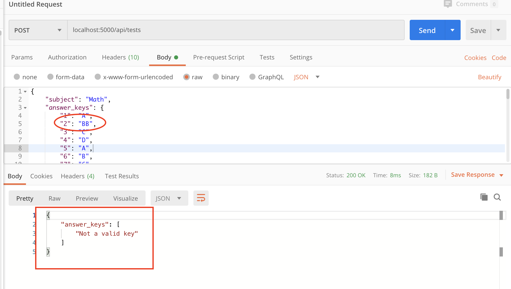
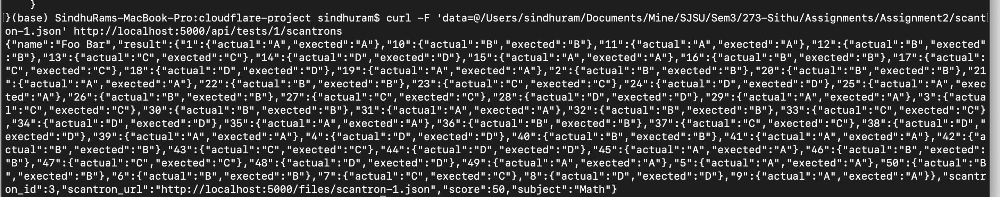
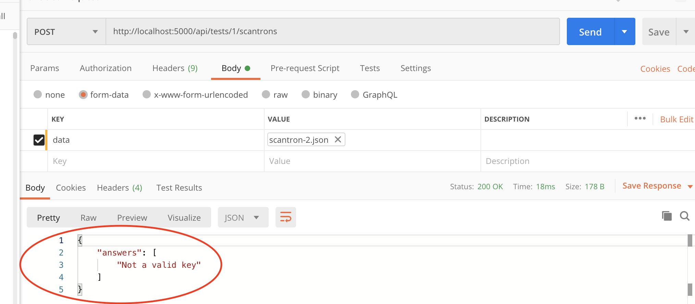
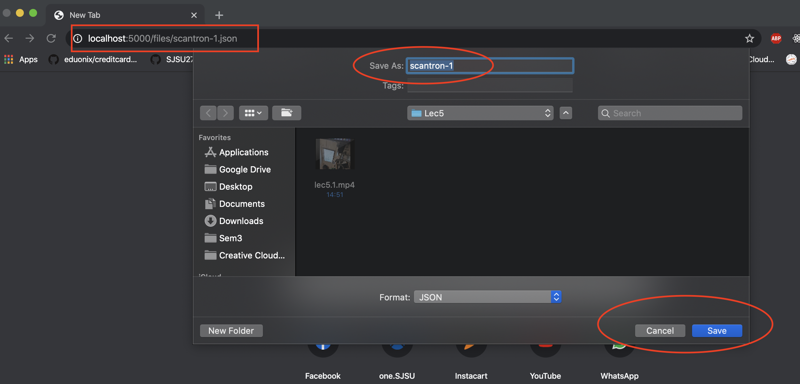

# Assignment 2

In the assignment 2, you will be building a scantron OCR application in Python Flask. The application handles:

* Scantron submission - **Done**
* Format validation - **Used Marshmallow for validation**
* Score calculation against answer keys - **Done**
* Score reporting - **Done**

ORM Framework - **Pewee**

Command to start the application - env FLASK_APP=app.py flask run

All the above features will be handled via a set of REST APIs. The application will persist data into a local SQLite DB.

# APIs

## Create a test

_Request_

> POST http://localhost:5000/api/tests

```json
{
	"subject": "Math",
    "answer_keys": {
		"1": "A",
        "2": "B",
        "3": "C",
        "4": "D",
        "5": "A",
        "6": "B",
        "7": "C",
        "8": "D",
        "9": "A",
        "10": "B",
        "11": "A",
        "12": "B",
        "13": "C",
        "14": "D",
        "15": "A",
        "16": "B",
        "17": "C",
        "18": "D",
        "19": "A",
        "20": "B",
        "21": "A",
        "22": "B",
        "23": "C",
        "24": "D",
        "25": "A",
        "26": "B",
        "27": "C",
        "28": "D",
        "29": "A",
        "30": "B",
        "31": "A",
        "32": "B",
        "33": "C",
        "34": "D",
        "35": "A",
        "36": "B",
        "37": "C",
        "38": "D",
        "39": "A",
        "40": "B",
        "41": "A",
        "42": "B",
        "43": "C",
        "44": "D",
        "45": "A",
        "46": "B",
        "47": "C",
        "48": "D",
        "49": "A",
        "50": "B"
    }
}
```

_Response_

```json
201 Created

{
    "answer_keys": {
        "1": "A",
        "10": "B",
        "11": "A",
        "12": "B",
        "13": "C",
        "14": "D",
        "15": "A",
        "16": "B",
        "17": "C",
        "18": "D",
        "19": "A",
        "2": "B",
        "20": "B",
        "21": "A",
        "22": "B",
        "23": "C",
        "24": "D",
        "25": "A",
        "26": "B",
        "27": "C",
        "28": "D",
        "29": "A",
        "3": "C",
        "30": "B",
        "31": "A",
        "32": "B",
        "33": "C",
        "34": "D",
        "35": "A",
        "36": "B",
        "37": "C",
        "38": "D",
        "39": "A",
        "4": "D",
        "40": "B",
        "41": "A",
        "42": "B",
        "43": "C",
        "44": "D",
        "45": "A",
        "46": "B",
        "47": "C",
        "48": "D",
        "49": "A",
        "5": "A",
        "50": "B",
        "6": "B",
        "7": "C",
        "8": "D",
        "9": "A"
    },
    "subject": "Math",
    "submissions": [],
    "test_id": 1
}
```
### Validation of input



## Upload a scantron

_Request_

> POST http://localhost:5000/api/tests/1/scantrons


```
curl -F 'data=@path/to/local/scantron-1.json' http://localhost:5000/api/tests/1/scantrons
```

### Curl Response




### Postman Response
_Response_

```json
201 Created

{
    "name": "Foo Bar",
    "result": {
        "1": {
            "actual": "A",
            "exected": "A"
        },
        "10": {
            "actual": "B",
            "exected": "B"
        },
        "11": {
            "actual": "A",
            "exected": "A"
        },
        "12": {
            "actual": "B",
            "exected": "B"
        },
        "13": {
            "actual": "C",
            "exected": "C"
        },
        "14": {
            "actual": "D",
            "exected": "D"
        },
        "15": {
            "actual": "A",
            "exected": "A"
        },
        "16": {
            "actual": "B",
            "exected": "B"
        },
        "17": {
            "actual": "C",
            "exected": "C"
        },
        "18": {
            "actual": "D",
            "exected": "D"
        },
        "19": {
            "actual": "A",
            "exected": "A"
        },
        "2": {
            "actual": "B",
            "exected": "B"
        },
        "20": {
            "actual": "B",
            "exected": "B"
        },
        "21": {
            "actual": "A",
            "exected": "A"
        },
        "22": {
            "actual": "B",
            "exected": "B"
        },
        "23": {
            "actual": "C",
            "exected": "C"
        },
        "24": {
            "actual": "D",
            "exected": "D"
        },
        "25": {
            "actual": "A",
            "exected": "A"
        },
        "26": {
            "actual": "B",
            "exected": "B"
        },
        "27": {
            "actual": "C",
            "exected": "C"
        },
        "28": {
            "actual": "D",
            "exected": "D"
        },
        "29": {
            "actual": "A",
            "exected": "A"
        },
        "3": {
            "actual": "C",
            "exected": "C"
        },
        "30": {
            "actual": "B",
            "exected": "B"
        },
        "31": {
            "actual": "A",
            "exected": "A"
        },
        "32": {
            "actual": "B",
            "exected": "B"
        },
        "33": {
            "actual": "C",
            "exected": "C"
        },
        "34": {
            "actual": "D",
            "exected": "D"
        },
        "35": {
            "actual": "A",
            "exected": "A"
        },
        "36": {
            "actual": "B",
            "exected": "B"
        },
        "37": {
            "actual": "C",
            "exected": "C"
        },
        "38": {
            "actual": "D",
            "exected": "D"
        },
        "39": {
            "actual": "A",
            "exected": "A"
        },
        "4": {
            "actual": "D",
            "exected": "D"
        },
        "40": {
            "actual": "B",
            "exected": "B"
        },
        "41": {
            "actual": "A",
            "exected": "A"
        },
        "42": {
            "actual": "B",
            "exected": "B"
        },
        "43": {
            "actual": "C",
            "exected": "C"
        },
        "44": {
            "actual": "D",
            "exected": "D"
        },
        "45": {
            "actual": "A",
            "exected": "A"
        },
        "46": {
            "actual": "B",
            "exected": "B"
        },
        "47": {
            "actual": "C",
            "exected": "C"
        },
        "48": {
            "actual": "D",
            "exected": "D"
        },
        "49": {
            "actual": "A",
            "exected": "A"
        },
        "5": {
            "actual": "A",
            "exected": "A"
        },
        "50": {
            "actual": "B",
            "exected": "B"
        },
        "6": {
            "actual": "B",
            "exected": "B"
        },
        "7": {
            "actual": "C",
            "exected": "C"
        },
        "8": {
            "actual": "D",
            "exected": "D"
        },
        "9": {
            "actual": "A",
            "exected": "A"
        }
    },
    "scantron_id": 4,
    "scantron_url": "http://localhost:5000/files/scantron-1.json",
    "score": 50,
    "subject": "Math"
}
```

### Scantron Validation
If any of the keys don't have valid responses


### Downloading the scantron from generated scantron_url
Accessing scantron_url to download scantron



## Check all scantron submissions

_Request_

> GET http://localhost:5000/api/tests/1


_Response_

```json{
    "answer_keys": {
        "1": "A",
        "10": "B",
        "11": "A",
        "12": "B",
        "13": "C",
        "14": "D",
        "15": "A",
        "16": "B",
        "17": "C",
        "18": "D",
        "19": "A",
        "2": "B",
        "20": "B",
        "21": "A",
        "22": "B",
        "23": "C",
        "24": "D",
        "25": "A",
        "26": "B",
        "27": "C",
        "28": "D",
        "29": "A",
        "3": "C",
        "30": "B",
        "31": "A",
        "32": "B",
        "33": "C",
        "34": "D",
        "35": "A",
        "36": "B",
        "37": "C",
        "38": "D",
        "39": "A",
        "4": "D",
        "40": "B",
        "41": "A",
        "42": "B",
        "43": "C",
        "44": "D",
        "45": "A",
        "46": "B",
        "47": "C",
        "48": "D",
        "49": "A",
        "5": "A",
        "50": "B",
        "6": "B",
        "7": "C",
        "8": "D",
        "9": "A"
    },
    "subject": "Math",
    "submissions": [
        {
            "name": "Foo Bar",
            "result": {
                "1": {
                    "actual": "A",
                    "exected": "A"
                },
                "10": {
                    "actual": "B",
                    "exected": "B"
                },
                "11": {
                    "actual": "A",
                    "exected": "A"
                },
                "12": {
                    "actual": "B",
                    "exected": "B"
                },
                "13": {
                    "actual": "C",
                    "exected": "C"
                },
                "14": {
                    "actual": "D",
                    "exected": "D"
                },
                "15": {
                    "actual": "A",
                    "exected": "A"
                },
                "16": {
                    "actual": "B",
                    "exected": "B"
                },
                "17": {
                    "actual": "C",
                    "exected": "C"
                },
                "18": {
                    "actual": "D",
                    "exected": "D"
                },
                "19": {
                    "actual": "A",
                    "exected": "A"
                },
                "2": {
                    "actual": "B",
                    "exected": "B"
                },
                "20": {
                    "actual": "B",
                    "exected": "B"
                },
                "21": {
                    "actual": "A",
                    "exected": "A"
                },
                "22": {
                    "actual": "B",
                    "exected": "B"
                },
                "23": {
                    "actual": "C",
                    "exected": "C"
                },
                "24": {
                    "actual": "D",
                    "exected": "D"
                },
                "25": {
                    "actual": "A",
                    "exected": "A"
                },
                "26": {
                    "actual": "B",
                    "exected": "B"
                },
                "27": {
                    "actual": "C",
                    "exected": "C"
                },
                "28": {
                    "actual": "D",
                    "exected": "D"
                },
                "29": {
                    "actual": "A",
                    "exected": "A"
                },
                "3": {
                    "actual": "C",
                    "exected": "C"
                },
                "30": {
                    "actual": "B",
                    "exected": "B"
                },
                "31": {
                    "actual": "A",
                    "exected": "A"
                },
                "32": {
                    "actual": "B",
                    "exected": "B"
                },
                "33": {
                    "actual": "C",
                    "exected": "C"
                },
                "34": {
                    "actual": "D",
                    "exected": "D"
                },
                "35": {
                    "actual": "A",
                    "exected": "A"
                },
                "36": {
                    "actual": "B",
                    "exected": "B"
                },
                "37": {
                    "actual": "C",
                    "exected": "C"
                },
                "38": {
                    "actual": "D",
                    "exected": "D"
                },
                "39": {
                    "actual": "A",
                    "exected": "A"
                },
                "4": {
                    "actual": "D",
                    "exected": "D"
                },
                "40": {
                    "actual": "B",
                    "exected": "B"
                },
                "41": {
                    "actual": "A",
                    "exected": "A"
                },
                "42": {
                    "actual": "B",
                    "exected": "B"
                },
                "43": {
                    "actual": "C",
                    "exected": "C"
                },
                "44": {
                    "actual": "D",
                    "exected": "D"
                },
                "45": {
                    "actual": "A",
                    "exected": "A"
                },
                "46": {
                    "actual": "B",
                    "exected": "B"
                },
                "47": {
                    "actual": "C",
                    "exected": "C"
                },
                "48": {
                    "actual": "D",
                    "exected": "D"
                },
                "49": {
                    "actual": "A",
                    "exected": "A"
                },
                "5": {
                    "actual": "A",
                    "exected": "A"
                },
                "50": {
                    "actual": "B",
                    "exected": "B"
                },
                "6": {
                    "actual": "B",
                    "exected": "B"
                },
                "7": {
                    "actual": "C",
                    "exected": "C"
                },
                "8": {
                    "actual": "D",
                    "exected": "D"
                },
                "9": {
                    "actual": "A",
                    "exected": "A"
                }
            },
            "scantron_id": 1,
            "scantron_url": "http://localhost:5000/files/scantron-1.json",
            "score": 50,
            "subject": "Math"
        },
        {
            "name": "Foo Bar",
            "result": {
                "1": {
                    "actual": "C",
                    "exected": "A"
                },
                "10": {
                    "actual": "B",
                    "exected": "B"
                },
                "11": {
                    "actual": "A",
                    "exected": "A"
                },
                "12": {
                    "actual": "B",
                    "exected": "B"
                },
                "13": {
                    "actual": "C",
                    "exected": "C"
                },
                "14": {
                    "actual": "D",
                    "exected": "D"
                },
                "15": {
                    "actual": "A",
                    "exected": "A"
                },
                "16": {
                    "actual": "B",
                    "exected": "B"
                },
                "17": {
                    "actual": "C",
                    "exected": "C"
                },
                "18": {
                    "actual": "D",
                    "exected": "D"
                },
                "19": {
                    "actual": "A",
                    "exected": "A"
                },
                "2": {
                    "actual": "B",
                    "exected": "B"
                },
                "20": {
                    "actual": "B",
                    "exected": "B"
                },
                "21": {
                    "actual": "A",
                    "exected": "A"
                },
                "22": {
                    "actual": "B",
                    "exected": "B"
                },
                "23": {
                    "actual": "C",
                    "exected": "C"
                },
                "24": {
                    "actual": "D",
                    "exected": "D"
                },
                "25": {
                    "actual": "A",
                    "exected": "A"
                },
                "26": {
                    "actual": "B",
                    "exected": "B"
                },
                "27": {
                    "actual": "C",
                    "exected": "C"
                },
                "28": {
                    "actual": "D",
                    "exected": "D"
                },
                "29": {
                    "actual": "A",
                    "exected": "A"
                },
                "3": {
                    "actual": "C",
                    "exected": "C"
                },
                "30": {
                    "actual": "B",
                    "exected": "B"
                },
                "31": {
                    "actual": "A",
                    "exected": "A"
                },
                "32": {
                    "actual": "B",
                    "exected": "B"
                },
                "33": {
                    "actual": "C",
                    "exected": "C"
                },
                "34": {
                    "actual": "D",
                    "exected": "D"
                },
                "35": {
                    "actual": "A",
                    "exected": "A"
                },
                "36": {
                    "actual": "B",
                    "exected": "B"
                },
                "37": {
                    "actual": "C",
                    "exected": "C"
                },
                "38": {
                    "actual": "D",
                    "exected": "D"
                },
                "39": {
                    "actual": "A",
                    "exected": "A"
                },
                "4": {
                    "actual": "D",
                    "exected": "D"
                },
                "40": {
                    "actual": "B",
                    "exected": "B"
                },
                "41": {
                    "actual": "A",
                    "exected": "A"
                },
                "42": {
                    "actual": "B",
                    "exected": "B"
                },
                "43": {
                    "actual": "C",
                    "exected": "C"
                },
                "44": {
                    "actual": "D",
                    "exected": "D"
                },
                "45": {
                    "actual": "A",
                    "exected": "A"
                },
                "46": {
                    "actual": "B",
                    "exected": "B"
                },
                "47": {
                    "actual": "C",
                    "exected": "C"
                },
                "48": {
                    "actual": "D",
                    "exected": "D"
                },
                "49": {
                    "actual": "A",
                    "exected": "A"
                },
                "5": {
                    "actual": "D",
                    "exected": "A"
                },
                "50": {
                    "actual": "B",
                    "exected": "B"
                },
                "6": {
                    "actual": "B",
                    "exected": "B"
                },
                "7": {
                    "actual": "C",
                    "exected": "C"
                },
                "8": {
                    "actual": "D",
                    "exected": "D"
                },
                "9": {
                    "actual": "A",
                    "exected": "A"
                }
            },
            "scantron_id": 2,
            "scantron_url": "http://localhost:5000/files/scantron-2.json",
            "score": 48,
            "subject": "Math"
        }
    ],
    "test_id": 1
}
```


